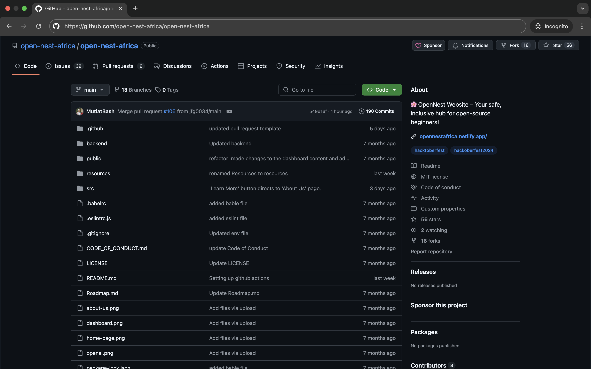
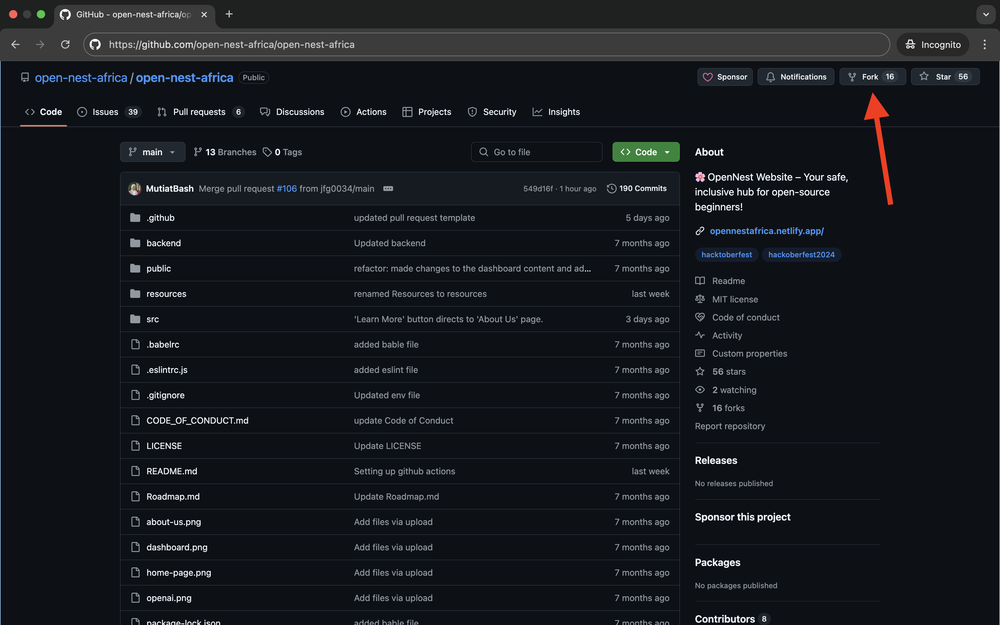
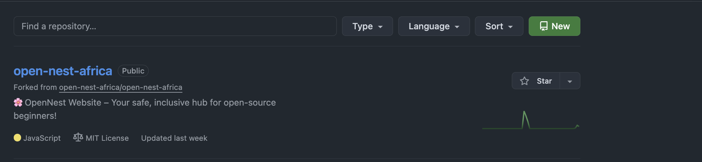
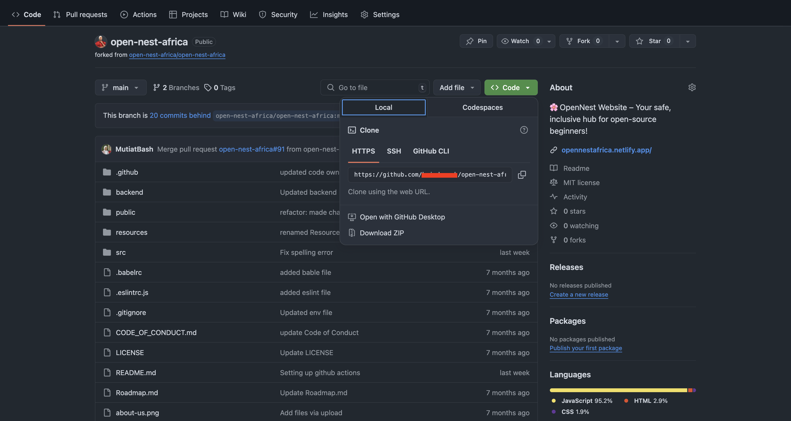
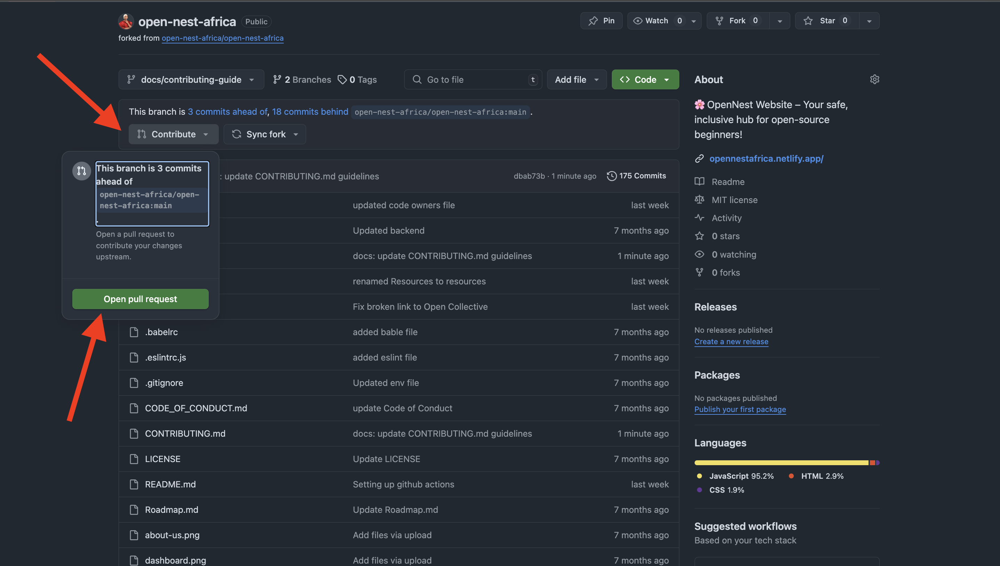
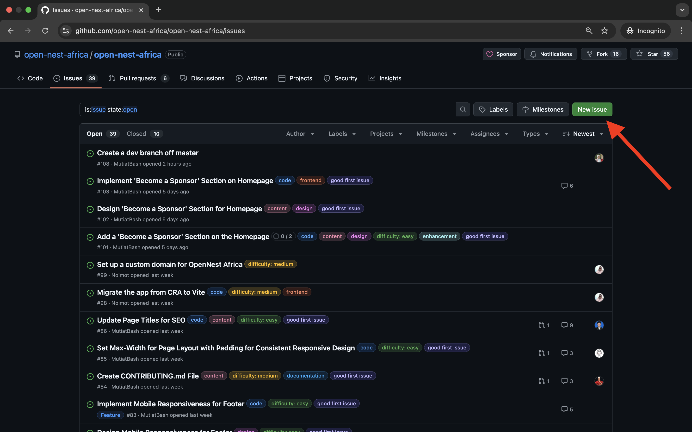
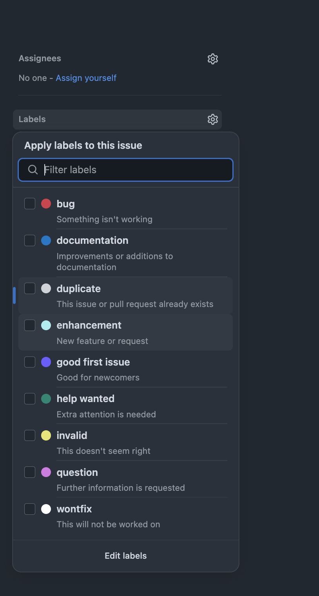
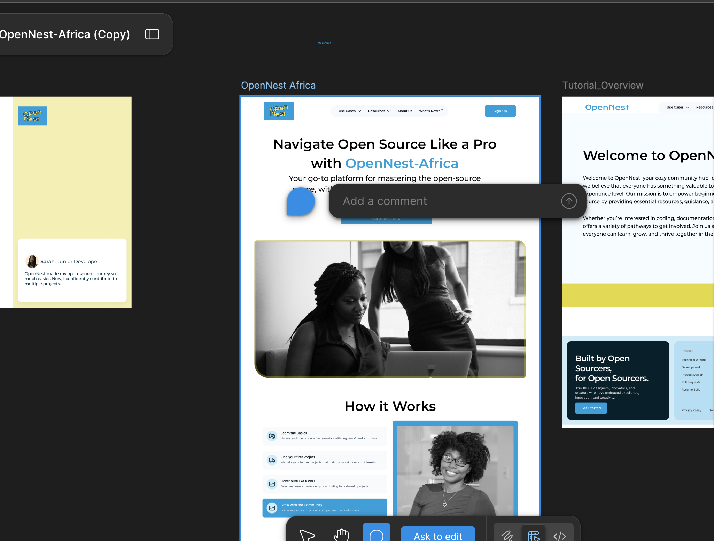
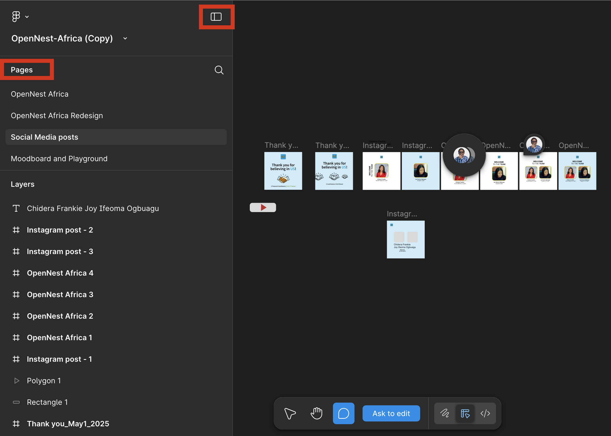
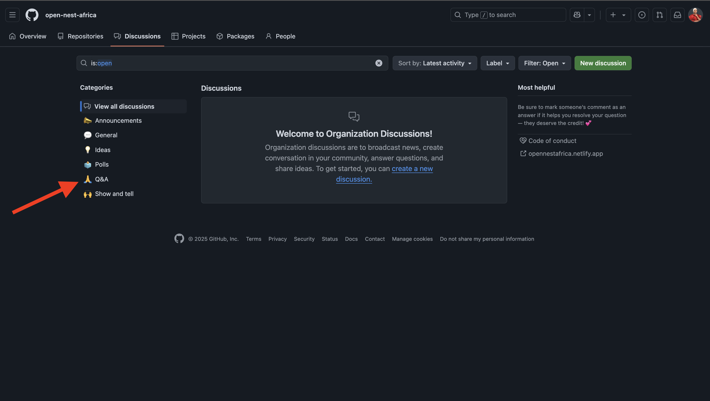

# Contributing to Open Nest Africa

🎉 Thank you for your interest in contributing to **Open Nest Africa**! We're excited to grow this community together. This guide will walk you through how to get started and contribute effectively.

---

## 📌 Table of Contents

- [Getting Started](#getting-started)
    - [Forking the Repository](#forking-the-repository)
    - [Cloning the Repository](#cloning-the-repository)
    - [Creating a Branch](#creating-a-branch)
- [Code Guidelines](#code-guidelines)
- [Commit Message Guidelines](#commit-message-guidelines)
    - [Code Style and Standards](#code-style-and-standards)
- [Making Contributions](#making-contributions)
    - [Submitting a Pull Request](#submitting-a-pull-request)
    - [Testing Requirements](#testing-requirements)
- [Reporting Bugs or Issues](#reporting-bugs-or-issues)
- [Contributing as a Designer](#contributing-as-a-designer)
- [Need Help?](#need-help)

---

## Getting Started

### Forking the Repository

1. Go to the [Open Nest Africa GitHub page](https://github.com/open-nest-africa/open-nest-africa).

2. Click the **Fork** button in the top right corner.

3. This will create a copy of the repository under your GitHub account.

### Cloning the Repository

1. Get the Clone URL
    - Go to your forked repository on GitHub (it should be under your account, e.g., [https://github.com/<your-username\>/open-nest-africa](https://github.com/your-username/open-nest-africa)).
    
    - Click the "Code" button (green button).
    - Copy the HTTPS or SSH URL
      (e.g., [https://github.com/<your-username\>/open-nest-africa.git](https://github.com/your-username/open-nest-africa.git) or [git@github.com:<your-username\>/open-nest-africa.git](git@github.com:<your-username>/open-nest-africa.git)).
      
2. Clone the Repository
    - Open a terminal (or Git Bash on Windows) and run:
      
      ```git clone https://github.com/<your-username>/open-nest-africa.git```
      **(Replace with your actual fork URL.)**
      
    *If using SSH (it requires [SSH key setup](https://docs.github.com/en/authentication/connecting-to-github-with-ssh)):*
   
      ```git clone git@github.com:<your-username>/open-nest-africa.git```

4. Navigate into the Cloned Repository

   ```cd open-nest-africa```

### Creating a Branch

Create a new branch before making changes:
Example:

    git checkout -b feature/your-feature-name
    
    # or
    
    git checkout -b fix/your-bugfix-name

## Code Guidelines

### Commit Message Guidelines
Use clear and concise commit messages.
Follow this format:

    type: short summary
    
    Detailed explanation (optional)

### Types include:

    feat: New feature
    
    fix: Bug fix
    
    docs: Documentation changes
    
    refactor: Code restructuring
    
    test: Adding or updating tests
    
    chore: Routine tasks

Example of Commit Message:

    feat: add user authentication

### Code Style and Standards

- Use consistent indentation (e.g., 2 or 4 spaces).
- Follow the project’s existing file structure and naming conventions.
- Use meaningful variable and function names.
- Avoid commented-out code.
- Run linters/formatters before pushing.

## Making Contributions

### Submitting a Pull Request
- Push your branch:
  
  ```git push origin feature/your-feature-name```
- Go to the forked repo on GitHub and click Compare & Pull Request.

- Fill in the PR template (if available) with:
    - Summary of changes
    - Issue linked (if applicable)
    - Screenshots or test outputs (if relevant)
    - Submit your PR!
      
Wait for maintainers to review and give feedback.

### Testing Requirements
- Ensure your changes do not break existing features.
- Write tests if applicable.
- Run existing test suites using:

    ```npm test```

### Reporting Bugs or Issues
- Spotted a bug or have an idea?
  
  Please: Go to the Issues tab.
    - Click New Issue.
    
    - Use the appropriate template (Bug Report, Feature Request, Documentation etc.).
    
    - Provide as much detail as possible, including:
        - Steps to reproduce
        - Expected vs actual behaviour
        - Environment (browser, OS, etc.)
        - Screenshots (if any)

## Contributing As A Designer
We welcome design contributions to make Open Nest Africa more user-friendly, accessible, and visually appealing. Whether you want to give feedback or propose new design ideas, we’d love your input.

1. 🖼️ Access the Figma Design File
👉 
    If you'd like to leave comments or edit directly, request access by:
        - Opening a GitHub issue with your Figma username, or
        - Contacting the team via [Slack](https://opennestafrica.slack.com)


2. ✍️ How Designers Can Contribute
- Leave suggestions in comment mode on Figma
- Propose new layouts, components, or styles
- Share accessibility or UX feedback
- Create mobile/desktop mockups or component variants


3. 📤 Submitting Design Work
You can share your design suggestions by:

- Linking your Figma frame or file in an Issue
- Starting a Discussion


###### 📝 Tip: When submitting designs, include a short description explaining the goal or problem you're addressing.

## Need Help?
If you have questions or want to discuss ideas:

   - Check the existing discussions
   - Ask your question in the Q&A discussions category
   
   - Reach out via 

**Thank you for contributing to Open Nest Africa! 🚀🫶🏼**